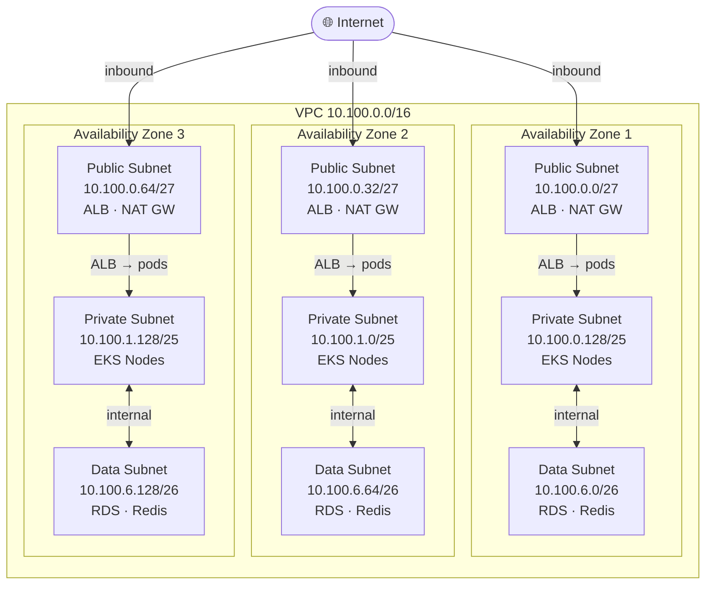
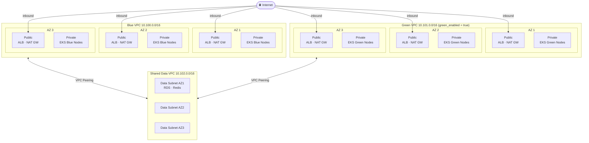

# tf-module-vpc

Terraform module for AWS VPC with production-grade 3 AZ high-availability design, optimized for EKS.

---

## Overview

This module provisions VPC infrastructure with a toggle between two deployment modes:

| Mode | VPCs created | Use case |
|---|---|---|
| `standalone` | 1 VPC | Single EKS cluster — in-place upgrades |
| `blue_green` | 3 VPCs (blue + green + data) | Zero-downtime cluster swap via full VPC isolation |

---

## EKS Deployment Modes

### `standalone` — in-place upgrades

Single VPC with all tiers. Upgrade EKS in place — rolling node group updates, managed node group version bumps.



### `blue_green` — zero-downtime cluster swap

Three separate, fully isolated VPCs. Blue and green each have their own IGW, NAT Gateways, public and private subnets. Both peer to a shared data VPC so RDS/Redis is not duplicated.



**Upgrade lifecycle:**

| Step | Action |
|---|---|
| Day 0 | `green_enabled = false` — Blue VPC + Data VPC provisioned, peered |
| Upgrade | `green_enabled = true` — Green VPC provisioned, peered to Data VPC |
| Cutover | New EKS cluster in Green validated → ALB/DNS flipped Blue → Green |
| Teardown | Blue VPC destroyed entirely — true isolation, no shared blast radius |

---

## Usage

### Standalone mode

```hcl
module "vpc" {
  source = "./aj-tf-module-vpc"

  vpc_name            = "myapp"
  environment         = "prod"
  eks_deployment_mode = "standalone"
  eks_cluster_name    = "myapp-prod"

  standalone_vpc_cidr             = "10.100.0.0/16"
  standalone_public_subnet_cidrs  = ["10.100.0.0/27",   "10.100.0.32/27",  "10.100.0.64/27"]
  standalone_private_subnet_cidrs = ["10.100.0.128/25", "10.100.1.0/25",   "10.100.1.128/25"]
  standalone_data_subnet_cidrs    = ["10.100.6.0/26",   "10.100.6.64/26",  "10.100.6.128/26"]
}
```

### Blue/Green mode — Day 0 (blue only)

```hcl
module "vpc" {
  source = "./aj-tf-module-vpc"

  vpc_name              = "myapp"
  environment           = "prod"
  eks_deployment_mode   = "blue_green"
  eks_blue_cluster_name = "myapp-prod-blue"
  green_enabled         = false

  blue_vpc_cidr            = "10.100.0.0/16"
  blue_public_subnet_cidrs = ["10.100.0.0/27",   "10.100.0.32/27",  "10.100.0.64/27"]
  blue_private_subnet_cidrs = ["10.100.0.128/25", "10.100.1.0/25",  "10.100.1.128/25"]

  data_vpc_cidr      = "10.102.0.0/16"
  data_subnet_cidrs  = ["10.102.0.0/26", "10.102.0.64/26", "10.102.0.128/26"]
}
```

### Blue/Green mode — Upgrade day (green_enabled = true)

```hcl
module "vpc" {
  source = "./aj-tf-module-vpc"

  vpc_name               = "myapp"
  environment            = "prod"
  eks_deployment_mode    = "blue_green"
  eks_blue_cluster_name  = "myapp-prod-blue"
  eks_green_cluster_name = "myapp-prod-green"
  green_enabled          = true                  # ← flip this

  blue_vpc_cidr             = "10.100.0.0/16"
  blue_public_subnet_cidrs  = ["10.100.0.0/27",   "10.100.0.32/27",  "10.100.0.64/27"]
  blue_private_subnet_cidrs = ["10.100.0.128/25", "10.100.1.0/25",   "10.100.1.128/25"]

  green_vpc_cidr             = "10.101.0.0/16"
  green_public_subnet_cidrs  = ["10.101.0.0/27",   "10.101.0.32/27",  "10.101.0.64/27"]
  green_private_subnet_cidrs = ["10.101.0.128/25", "10.101.1.0/25",   "10.101.1.128/25"]

  data_vpc_cidr     = "10.102.0.0/16"
  data_subnet_cidrs = ["10.102.0.0/26", "10.102.0.64/26", "10.102.0.128/26"]
}
```

---

## Inputs

### Shared

| Name | Required | Default | Description |
|---|---|---|---|
| `vpc_name` | yes | — | Drives all resource naming |
| `aws_region` | no | `us-east-1` | AWS region |
| `environment` | no | `dev` | Environment label |
| `eks_deployment_mode` | no | `blue_green` | `standalone` or `blue_green` |
| `az_count` | no | `3` | Number of AZs (2–3) |
| `availability_zones` | no | us-east-1a/b/c | AZ list |
| `team` | no | `infra-core` | Tag |
| `cost_center` | no | `infra-2026-q1` | Tag |
| `common_tags` | no | see vars | Merged into provider default_tags |
| `tags` | no | `{}` | Additional tags |

### `standalone` mode

| Name | Required | Description |
|---|---|---|
| `standalone_vpc_cidr` | yes | VPC CIDR |
| `standalone_public_subnet_cidrs` | yes | One per AZ |
| `standalone_private_subnet_cidrs` | yes | One per AZ |
| `standalone_data_subnet_cidrs` | yes | One per AZ |
| `eks_cluster_name` | no | EKS cluster name for subnet tags |

### `blue_green` mode

| Name | Required | Description |
|---|---|---|
| `green_enabled` | no (`false`) | Set `true` to provision green VPC |
| `blue_vpc_cidr` | yes | Blue VPC CIDR |
| `blue_public_subnet_cidrs` | yes | One per AZ |
| `blue_private_subnet_cidrs` | yes | One per AZ |
| `green_vpc_cidr` | when green_enabled | Green VPC CIDR |
| `green_public_subnet_cidrs` | when green_enabled | One per AZ |
| `green_private_subnet_cidrs` | when green_enabled | One per AZ |
| `data_vpc_cidr` | yes | Shared data VPC CIDR |
| `data_subnet_cidrs` | yes | One per AZ |
| `eks_blue_cluster_name` | no | Blue cluster name for subnet tags |
| `eks_green_cluster_name` | no | Green cluster name for subnet tags |

---

## Outputs

### `standalone` mode

| Name | Description |
|---|---|
| `vpc_id` | VPC ID |
| `public_subnet_ids` | Public subnet IDs |
| `private_subnet_ids` | Private subnet IDs |
| `data_subnet_ids` | Data subnet IDs |
| `nat_gateway_ids` | NAT Gateway IDs |
| `nat_public_ips` | NAT public IPs |
| `private_route_table_ids` | Private route table IDs |

### `blue_green` mode

| Name | Description |
|---|---|
| `blue_vpc_id` | Blue VPC ID |
| `blue_public_subnet_ids` | Blue public subnet IDs |
| `blue_private_subnet_ids` | Blue private subnet IDs |
| `blue_data_peering_id` | Blue ↔ Data peering connection ID |
| `green_vpc_id` | Green VPC ID (null when green_enabled = false) |
| `green_public_subnet_ids` | Green public subnet IDs |
| `green_private_subnet_ids` | Green private subnet IDs |
| `green_data_peering_id` | Green ↔ Data peering connection ID |
| `data_vpc_id` | Shared data VPC ID |
| `data_vpc_subnet_ids` | Shared data subnet IDs (RDS/Redis) |

All outputs are `null` or `[]` when not applicable to the active mode.

---

## Cost Note

NAT Gateways: ~$32/month each. 3 AZs × 3 VPCs (blue_green with green enabled) = up to 9 NAT GWs (~$288/month). Green VPC is provisioned only during upgrades — destroy it after cutover to eliminate the cost.

Use `az_count = 2` for non-prod to reduce costs further.
